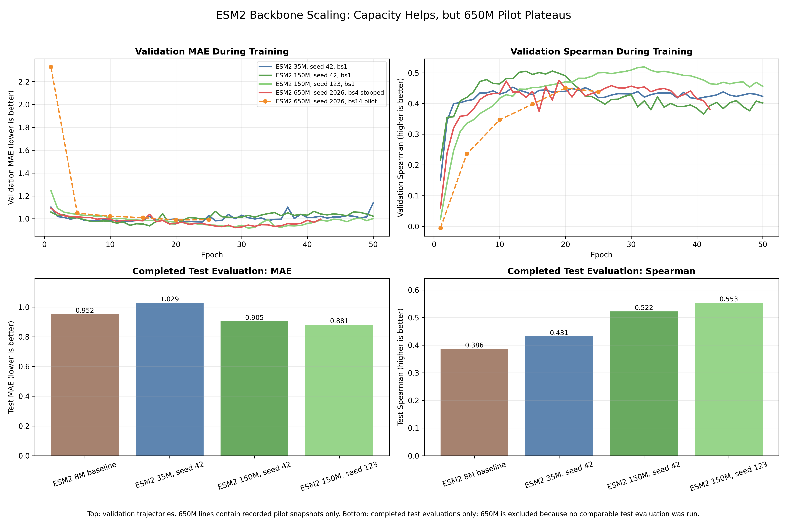

# Antibody-Antigen Affinity Regression with ESM2 + LoRA

This repository presents a leakage-aware antibody-antigen affinity regression study using ESM2, LoRA fine-tuning, CDR-aware inputs, and learnable CDR-to-antigen cross-attention.

The main benchmark is the **ANDD antibody v2 stratified antigen-level split**, with target:

```text
y = -log10(Kd)
```

Higher values mean stronger binding.

## Key Findings

- Absolute affinity regression exhibits systematic prediction compression: weak binders tend to be overpredicted and strong binders tend to be underpredicted.
- An overfit sanity check identified a capacity / representation bottleneck: ESM2 8M could not adequately fit a fixed 64-sample subset, while ESM2 35M could.
- Scaling to ESM2 150M improved completed test evaluation metrics over the ESM2 8M cross-attention baseline across the first two available seeds.
- An ESM2 650M pilot plateaued on validation and did not provide evidence that further scaling would improve generalization under the current sequence-only setup.
- Tail-aware loss and CDR3 contact features provided partial gains, but neither fully resolved regression-to-the-mean.

## Backbone Scaling Results

| model | seed | evaluation split | MAE | Spearman | notes |
|---|---:|---|---:|---:|---|
| ESM2 8M cross-attention baseline | 42 | test | 0.9523 | 0.3861 | compressed predictions |
| ESM2 35M cross-attention | 42 | test | 1.0288 | 0.4314 | better ranking, weaker MAE |
| ESM2 150M cross-attention | 42 | test | 0.9047 | 0.5221 | improved MAE and ranking |
| ESM2 150M cross-attention | 123 | test | 0.8815 | 0.5532 | improvement reproduced |
| ESM2 650M cross-attention bs14 pilot | 2026 | validation | 0.9899 | 0.4501 | plateaued around epoch 20 |
| ESM2 650M cross-attention bs4 pilot | 2026 | validation | 0.9277 | 0.4565 | stopped after validation plateau |

The 650M rows are validation pilots and are intentionally not presented as direct test-set comparisons. The bs14 pilot motivated a smaller-batch bs4 follow-up with more optimization steps per epoch.



## Study Design

The project started from sequence-only affinity regression and progressed through:

1. ANDD antibody-only data audit and conservative benchmark construction.
2. Standard CDR extraction using AbNumber / IMGT.
3. All-CDR pooled and all-CDR cross-attention baselines.
4. Regression-to-the-mean diagnosis across train / validation / test.
5. Tail-aware loss experiments and multi-seed validation.
6. Contact/interface feature availability audit.
7. Basic interface geometry extraction.
8. CDR-to-structure mapping validation.
9. CDR3 contact residual-correction subset analysis.
10. Controlled ESM2 backbone scaling from 8M to 35M, 150M, and a stopped 650M pilot.

## Engineering Scope

This repository documents:

- Careful biomedical dataset curation and leakage-aware splitting.
- Standard CDR extraction rather than fixed-index slicing.
- Sequence-only, CDR-aware, cross-attention, and tail-aware modeling.
- Systematic error analysis instead of blindly changing architectures.
- Multi-seed validation before trusting a single positive result.
- Structure/contact feature feasibility checks before claiming structure-aware modeling.
- Scientific honesty about what the model did and did not solve.

## Repository Contents

```text
src/                          Core model, dataset, training, and evaluation code
scripts/                      Data audit, CDR extraction, evaluation, plotting scripts
configs/                      Selected final experiment configs
reports/final_reports/        Research reports and experiment summaries
reports/final_reports/figures/ Presentation-ready figures
reports/andd_stratified/      Key ANDD stratified model reports and summary CSVs
reports/contact_feature_audit/ Contact/interface audit reports and lightweight feature CSVs
data_reports/                 Dataset split and audit summary reports
notes/                        Paper notes and reproduction plan
docs/                         GitHub export manifest and script guide
```

## Important Reports

- `reports/final_reports/andd_v2_affinity_regression_final_report.md`
- `reports/final_reports/final_results_index.md`
- `reports/andd_stratified/andd_stratified_model_summary.md`
- `reports/contact_feature_audit/contact_interface_audit_summary.md`
- `reports/final_reports/esm150M_interim_seed42_seed123_summary.md`
- `reports/final_reports/esm650M_bs14_e25_summary.md`
- `reports/final_reports/esm650M_bs4_stopped_summary.md`

## Presentation Figures

- `reports/final_reports/figures/final_fig1_prediction_compression_across_splits.png`
- `reports/final_reports/figures/final_fig2_residual_trend_regression_to_mean.png`
- `reports/final_reports/figures/final_fig3_multiseed_tailaware_w2.png`
- `reports/final_reports/figures/final_fig4_cdr3_contact_augmentation.png`
- `reports/final_reports/figures/final_fig5_contact_interface_availability_funnel.png`
- `reports/final_reports/figures/final_fig6_cdr_mapping_validation.png`
- `reports/final_reports/figures/backbone_scaling_8M_35M_150M_650M.png`

## Selected Final Configs

The repo keeps only the key final configs, rather than every intermediate sweep file:

- `configs/config_affinity_andd_antibody_v2_stratified_all_cdr_pooled_lr3e-5_e10.yaml`
- `configs/config_affinity_andd_antibody_v2_stratified_cross_attention_all_cdrs_lr3e-5_e10.yaml`
- `configs/config_affinity_andd_antibody_v2_stratified_cross_attention_all_cdrs_tailaware_w2_lr3e-5_e20.yaml`
- `configs/config_affinity_andd_antibody_v2_stratified_cross_attention_all_cdrs_unweighted_s42_lr3e-5_e20.yaml`
- `configs/config_affinity_andd_antibody_v2_stratified_cross_attention_all_cdrs_esm150M_unweighted_lr1e-5_e50.yaml`

## Data Availability

Large raw datasets and structures are intentionally **not included** in this GitHub export.

Local-only inputs used during the project included:

- ANDD v2 spreadsheet
- SAbDab summary files
- SAbDab all-structures archive
- processed train / validation / test CSVs
- model checkpoints

The code expects local data paths matching the original project structure. See `data_reports/` for dataset construction and split summaries.

## Reproducibility Notes

Training used the project `.venv` environment. Standard CDR extraction used a separate `abnumber-cdr` conda environment with AbNumber / ANARCI / HMMER.

Example commands from the final stage:

```bash
./.venv/bin/python run_train_affinity_cross_attention.py \
  --config configs/config_affinity_andd_antibody_v2_stratified_cross_attention_all_cdrs_lr3e-5_e10.yaml

./.venv/bin/python scripts/evaluate_andd_antibody_v2_stratified_cross_attention_test_set.py \
  --config configs/config_affinity_andd_antibody_v2_stratified_cross_attention_all_cdrs_lr3e-5_e10.yaml
```

For GitHub users, paths in configs may need to be adjusted to local data locations.

## What Is Not Included

To keep the repository lightweight and GitHub-safe, this export excludes:

- raw ANDD spreadsheets
- SAbDab all-structures archive
- local PDB cache
- model checkpoints
- virtual environments
- large prediction dumps

The final figures and summary CSVs needed to understand the project are included.

## Main Scientific Takeaway

The model did not simply fail. The experiments exposed a systematic bottleneck: sequence-only models compressed affinity predictions toward the mean. Increasing backbone capacity helped substantially up to ESM2 150M, but the 650M pilot did not show a convincing generalization advantage. Tail-aware loss and contact features offered partial gains, but simple scalar contact features were not sufficient to solve the core compression issue.

This motivates future work on richer structure/contact-aware representations and ranking-based antibody binder prioritization.

## Recommended Next Step

The natural continuation is a ranking-based antibody binder prioritization project inspired by AbRank-style task framing. The next study should test whether pairwise or listwise ranking better supports candidate prioritization while retaining the current leakage-aware benchmark design.
